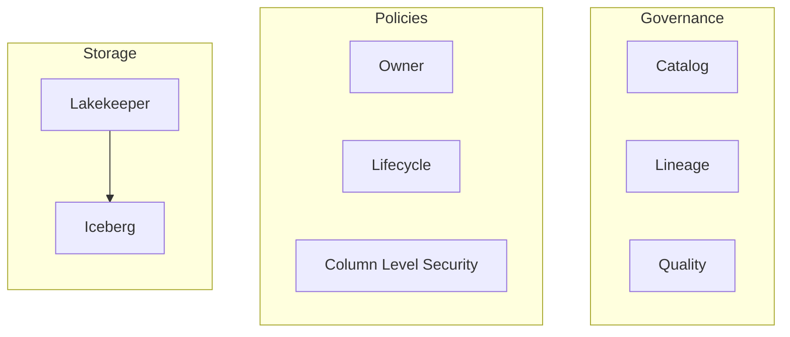

# Data Governance

Data governance across the platform: catalog, lineage, quality, ownership and lifecycle
policies, backed by a governed lakehouse storage layer.

```mermaid
graph TD
    subgraph Governance
        Catalog
        Lineage
        Quality
    end

    subgraph Policies
        Owner
        Lifecycle
        Column_Level_Security[Column Level Security]
    end

    subgraph Storage[Storage]
        direction TB
        Lakekeeper --> Iceberg
    end
```
