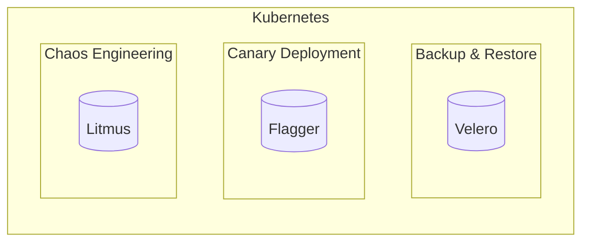

# Site Reliability Engineering

Reliability capabilities for Kubernetes and data platform services: backup and restore,
progressive delivery and chaos engineering.

```mermaid
graph TD
    subgraph Kubernetes
        direction TD
        subgraph BackupRestore["Backup & Restore"]
            Velero[(Velero)]
        end

        subgraph CanaryDeployment["Canary Deployment"]
            Flagger[(Flagger)]
        end

        subgraph ChaosEngineering["Chaos Engineering"]
            Litmus[(Litmus)]
        end
    end
```
